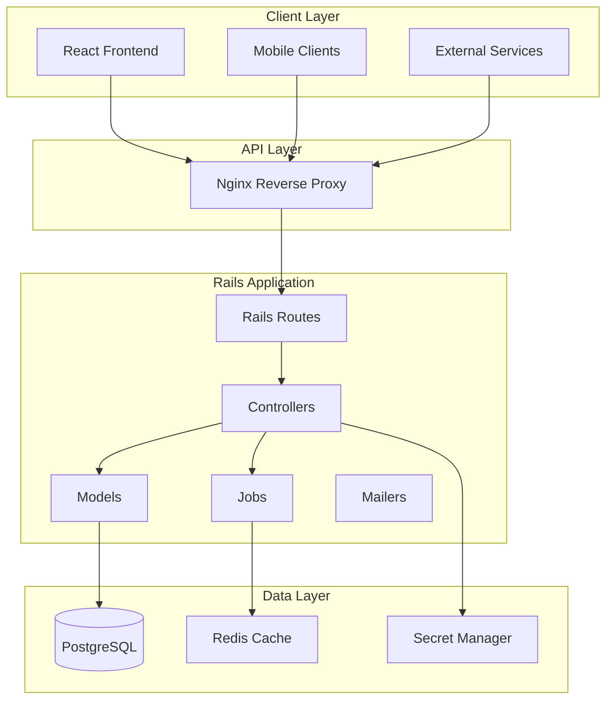
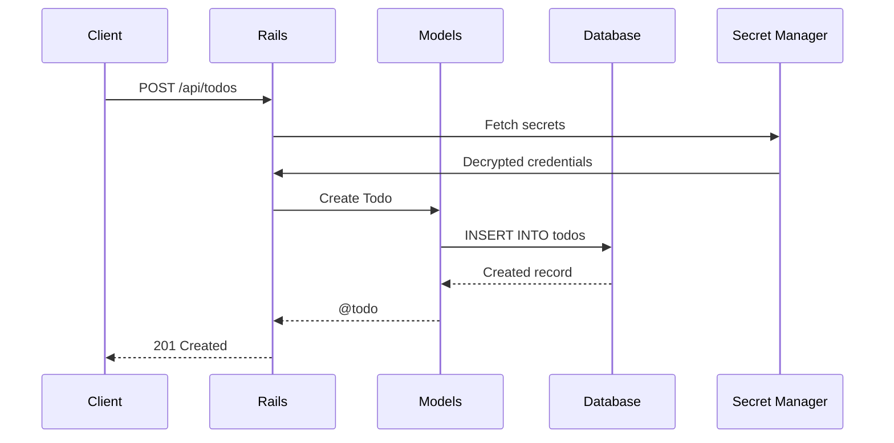
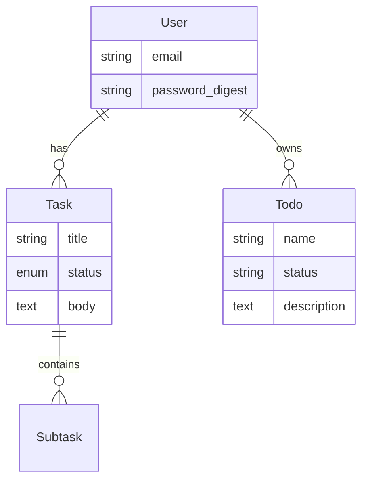

# Backend API

Rails 8 API application providing task management endpoints.

## Architecture



## Request Flow



## Models



## API Endpoints

| Method | Path | Description |
|--------|------|-------------|
| GET | /api/health | Health check |
| GET | /api/todos | List todos |
| POST | /api/todos | Create todo |
| PUT | /api/todos/:id | Update todo |
| DELETE | /api/todos/:id | Delete todo |

## Development

```bash
# Start development server
bin/dev

# Run tests
bin/rails test

# Run linter
bundle exec rubocop
```

## Production

```bash
# Build Docker image
docker build -t jira-task-backend:latest .

# Run migrations
docker run jira-task-backend bin/rails db:migrate
```

## Secrets Management

Secrets are managed via environment variables:

```bash
DATABASE_URL=postgresql://...
RAILS_MASTER_KEY=...
SECRET_KEY_BASE=...
```
